Implementing CICD Pipeline for terraform using Jenkins


Implement a seamless CI/CD pipeline for Terraform using Jenkins in this project, enabling automated testing, deployment, and management of infrastructure-as-code with ease


Introduction to CI/CD and its importance in software development
Implementing CI/CD Pipeline for Terraform using Jenkins
Welcome to the comprehensive hands-on project on "Implementing CI/CD Pipeline for Terraform using Jenkins." In today's rapidly evolving IT landscape, efficient and reliable deployment of infrastructure is paramount. Continuous Integration and Continuous Deployment (CI/CD) have emerged as indispensable practices, fostering automation and agility in the software development lifecycle. In this project, we will explore the powerful combination of Terraform, a leading Infrastructure as Code (IaC) tool, and Jenkins, a widely-used automation server, to streamline and enhance infrastructure deployment workflows.
Project Overview:
In the journey ahead, we will delve into the intricacies of building a robust CI/CD pipeline specifically tailored for Terraform projects. By automating the building, testing, and deployment of infrastructure changes, these pipelines enhance speed, reliability, and consistency across environments. The use of Infrastructure as Code (IaC) with Terraform ensures reproducibility and scalability, while Jenkins facilitates collaborative development, visibility, and continuous integration and deployment as you will see in this project. This approach not only reduces time-to-market but also promotes resource efficiency, cost optimization, and compliance with security standards. Overall, CI/CD pipelines with Terraform a1nd Jenkins empower organizations to adapt quickly to changing business requirements, fostering a culture of automation and continuous improvement in the dynamic landscape of modern software development and operations.


### Setting Up the Environment
Let's start the project by setting up a Jenkins server running in a docker container.

We will create a Dockerfile to define the configuration for our Jenkins server. This Dockerfile will include the necessary dependencies and configurations to run Jenkins seamlessly, and also to run terraform cli.
Dockerfile for Jenkins
Jenkins comes with a docker image that can be used out of the box to run a container with all the relevant dependencies for Jenkins. But because we have unique requirement to run terraform, we need to find a way to extend the readily available jenkins image.


The Jenkins official docker image can be found [here](https://hub.docker.com/_/jenkins)

Extending this image means we have to write our own dockerfile, and include all the other stuff we need. Lets go through that quickly.

1.	Create a directory and name it
2.	create a file and name it Dockerfile
3.	Add the below content in the dockerfile


```bash
 # Use the official Jenkins base image
 FROM jenkins/jenkins:lts

 # Switch to the root user to install additional packages
 USER root

 # Install necessary tools and dependencies (e.g., Git, unzip, wget, software-properties-common)
 RUN apt-get update && apt-get install -y \
     git \
     unzip \
     wget \
     software-properties-common \
     && rm -rf /var/lib/apt/lists/*

 # Install Terraform
 RUN apt-get update && apt-get install -y gnupg software-properties-common wget \
     && wget -O- https://apt.releases.hashicorp.com/gpg | gpg --dearmor | tee /usr/share/keyrings/hashicorp-archive-keyring.gpg \
     && gpg --no-default-keyring --keyring /usr/share/keyrings/hashicorp-archive-keyring.gpg --fingerprint \
     && echo "deb [signed-by=/usr/share/keyrings/hashicorp-archive-keyring.gpg] https://apt.releases.hashicorp.com $(lsb_release -cs) main" | tee /etc/apt/sources.list.d/hashicorp.list \
     && apt-get update && apt-get install -y terraform \
     && rm -rf /var/lib/apt/lists/*

 # Set the working directory
 WORKDIR /app

 # Print Terraform version to verify installation
 RUN terraform --version

 # Switch back to the Jenkins user
 USER jenkins


```

### Explaining the dockerfile
Before we proceed to building our custom jenkins image for terraform, lets go through that Dockerfile to understand what is going on step by step.


1.	Use the official Jenkins base image

```bash
FROM jenkins/jenkins:lts

```


This line specifies the base image for your Dockerfile. In this case, it's using the official Jenkins LTS (Long Term Support) image as a starting point.
2.	Switch to the root user to install additional packages

```bash
USER root
```

This command switches to the root user within the Docker image. This is done to perform actions that require elevated permissions, such as installing packages.


3.	Install necessary tools and dependencies (e.g., Git, unzip, wget, software-properties-common)

```bash
RUN apt-get update && apt-get install -y \
    git \
    unzip \
    wget \
    software-properties-common \
    && rm -rf /var/lib/apt/lists/*

```
This section installs various tools and dependencies needed for the image. The ```apt-get update```	command refreshes the
package list, and ```apt-get install ``` installs the specified packages (git, unzip, wget, software-properties-common). The && is used to chain commands, and rm -rf /var/lib/apt/lists/* removes unnecessary package list helping to reduce the size of the Docker image.


4.	Install Terraform
 
```bash
RUN apt-get update && apt-get install -y gnupg software-properties-common wget \
    && wget -O- https://apt.releases.hashicorp.com/gpg | gpg --dearmor | tee /usr/share/keyrings/hashicorp-archive-keyring.gpg \
    && gpg --no-default-keyring --keyring /usr/share/keyrings/hashicorp-archive-keyring.gpg --fingerprint \
    && echo "deb [signed-by=/usr/share/keyrings/hashicorp-archive-keyring.gpg] https://apt.releases.hashicorp.com $(lsb_release -cs) main" | tee /etc/apt/sources.list.d/hashicorp.list \
    && apt-get update && apt-get install -y terraform \
    && rm -rf /var/lib/apt/lists/*
```
 

 
This block installs Terraform. It follows similar steps as before: updating the package list, installing dependencies, adding HashiCorp's GPG key, configuring the repository, updating again, and finally installing Terraform. Again, it includes cleaning up unnecessary package lists.
A quick note on GPG Key: GPG (GNU Privacy Guard) is a free and open-source software for encrypting and signing data. In the context of software distribution, GPG keys are used to verify the integrity and authenticity of packages.
If you really want to get into the details of what the block of code is doing you can read the next section, otherwise you can skip to the next part of the dockerfile.

1.	Downloading HashiCorp's GPG key:


```bash
wget -O- https://apt.releases.hashicorp.com/gpg | gpg --dearmor | tee /usr/share/keyrings/hashicorp-archive-keyring.gpg

```

This command downloads HashiCorp's GPG key from ```https://apt.releases.hashicorp.com/gpg```
gpg --dearmor converts the key into a format that can be easily used by tools.
```tee /usr/share/keyrings/hashicorp-archive-keyring.gpg``` writes the key to the specified file with .gpg extension.

2.	Displaying the GPG key fingerprint:
```bash
gpg --no-default-keyring --keyring /usr/share/keyrings/hashicorp-archive-keyring.gpg --fingerprint
```

   This command displays the fingerprint of the GPG key. The fingerprint is a unique identifier for the key and is used to verify its authenticity.

3.	Configuring the repository with the GPG key:

```bash
echo "deb [signed-by=/usr/share/keyrings/hashicorp-archive-keyring.gpg] https://apt.releases.hashicorp.com $(lsb_release -cs) main" | tee /etc/apt/sources.list.d/hashicorp.list
```

This command adds HashiCorp's repository configuration to the system's package manager (apt in this case). It specifies the GPG key to be used for package verification.
 
4.	Updating and installing Terraform:
```bash
RUN apt-get update && apt-get install -y terraform && rm -rf /var/lib/apt/lists/*
```
  These commands update the package list, install Terraform, and then remove unnecessary package lists to reduce the size of the Docker image.
5.	Set the working directory
```bash
WORKDIR /app
```
 
This line sets the working directory for subsequent commands to container. This is where you'll be when you enter the container.

6.	Print Terraform version to verify installation
 ```bash
 RUN terraform --version
```
	 
This command prints the version of Terraform to the console, allowing you to verify that the installation was successful.

7.	Switch back to the Jenkins user
```bash
USER jenkins
```

Finally, this line switches back to the jenkins user, returning to a lower privilege level. This is a good security practice to minimize the risk of running processes as the root user within the container.


### Building and running the docker image
Now you should understand clearly that our mission right now is to have a docker container running Jenkins, but also have terraform installed.
Next is to build the docker image, and run it for further configuration.

Make sure that you are inside the folder containing the	. This is generally referred to as the ```docker build context```.The build context is the set of files located in the specified directory or path when you build a Docker image. The content of the build context is sent to the Docker daemon during the build process, and it serves as the source for building the Docker image.

1.	Build the custom jenkins image
 
```bash
 docker build -t jenkins-server . 
```
 	 

 
Notice the "." at the end. That is the ```Docker build context```, meaning the current directorywhere the Dockerfile is. 
  
 
2.	Run the image into a docker container

```bash
docker run -d -p 8080:8080 --name jenkins-server jenkins-server 
```

This should output a hash data like:

1e77f0dcc74d14c6ef5173d28a0dcf3b542bf89635ef0595619f775c205e4202
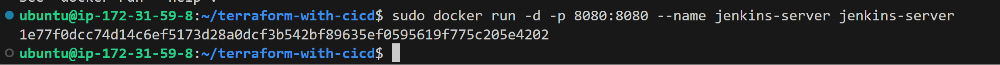
Lets break down that command for clear understanding.

```docker run```: This is the command used to run a Docker container.

```-d```: This flag stands for "detach." It runs the container in the background, allowing you to continue using the terminal for other commands.
 
```p 8080:8080 ```: This flag maps the port from the host to the port inside the container. It means that you can access the application running inside the container on your host machine's port 8080. Simply go to the browser and put in there	to display the application

```--name jenkins-server```: This flag assigns a name to the container. In this case, the name is set to "jenkins-server"


```jenkins-server```: This is the name of the Docker image that you want to run. It refers to the image named "jenkins-server" that was built earlier when we ran ```docker build``` command.

3.	Check that container is running : ```docker ps```

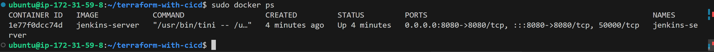


4.	Access the Jenkins server from the web browser on localhost:8080

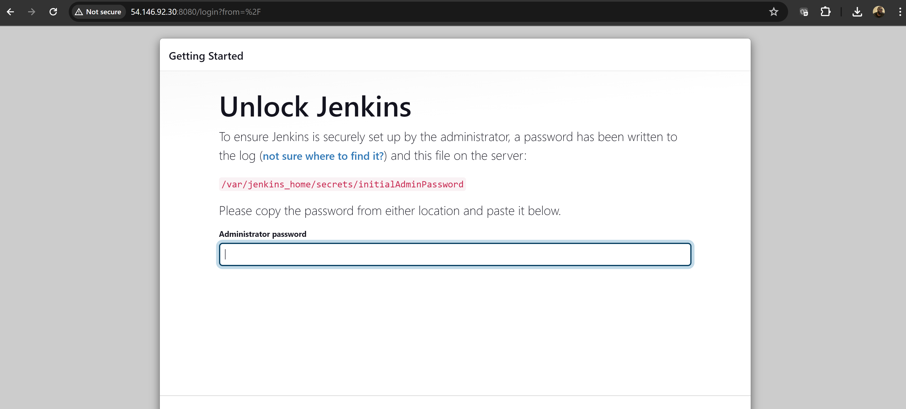

Access the jenkins server directly inside the container

```bash
sudo docker exec -it  1e77f0dcc74d  /bin/bash
```

Lets break down the command:

```sudo docker exec```: This command is used to execute a command in a running Docker container.

```-it```: These flags are often used together.

*   ```-i``` stands for "interactive," which allows you to interact with the container. 
*   ```-t``` allocates a pseudo-TTY, or terminal, enabling a more interactive session.
*   ```1e77f0dcc74d```: This is the Container ID or Container Name. It uniquely identifies the running container. In this case, replace it with the actual ID or name of your container. You can get this from the output of ```docker ps```
*   ```/bin/bash```: This is the command that you want to execute inside the container. In this example, it's launching an interactive Bash shell (bash) within the specified container.

So, when you run this command, Docker will:

*   Use the	```exec``` command to execute a command in a running container.
*   Use the	```-it``` flags to make the interaction with the container interactive.
*   Specify the Container ID or Container Name (in this case, "1e77f0dcc74d").
*   Specify the command to execute inside the container, which is ```/bin/bash```.

You will also notice that once you get into the container, the directory you get to find yourself is the ```/app```. Which is from the ```WORKDIR``` directive inside the ```dockerfile```.

docker exec -it 1e77f0dcc74d /bin/bash

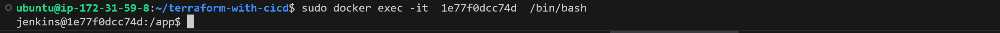


6.	Retrieve the initial Jenkins admin password

From the web UI, there is an instructon to retrieve the Initial Admin Password from

```bash
/var/jenkins_home/secrets/initialAdminPassword
```

Inside the container, run:

Retrieve password

```bash
cat /var/jenkins_home/secrets/initialAdminPassword
```

```f9c98f07211f4c299f96b3dd9e193e18```

7.	Installing Jenkins plugins

Paste the initial password in the web Click on "Install suggested plugins

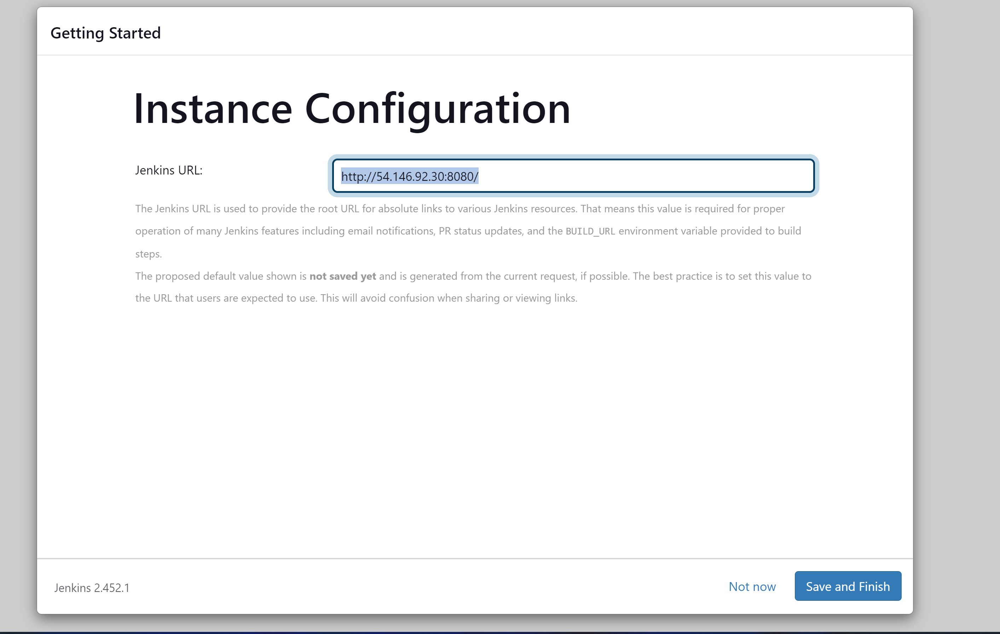
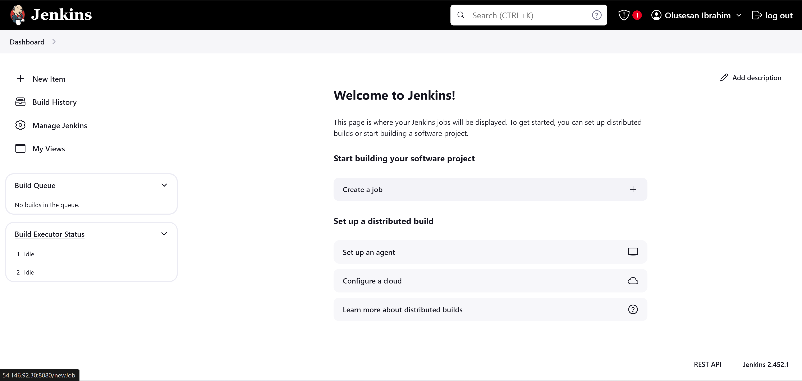


### Setting Up Jenkins for Terraform CI/CD
**Jenkins Pipelines for Terraform**
Here comes the real meat of this project where you will experience CI/CD pipeline for Terraform.

The first question that may come to your mind is "why do we need to have CI/CD for our infrastructure?", "I thought CI/CD is for the software code that developers write?" - Well you are correct if you have thought of those questions. But treating the infrastructure in which the software is being operated can also be treated in similar manner, especially now that we can have the entire infrastructure as code through "Terraform".
Treating our infrastructure the same way we would treat our software presents a set of benefits such as:

1.	Automating the release of features into our cloud infrastructure
2.	Experiencing a fast feedback loop for infrastructure changes
3.	Continous testing of our infrastructure
4.	Collaboration and Team Productivity
5.	Rapid Release Cycle and
6.	Risk Reduction in production

Now lets go through the entire process and see how it can be achieved with Jenkins.

##  Set up Git repository with Terraform code

The use case we will satisfy is that

1.	Your terraform code has an existing set of resources that it creates in your preferred cloud provider.
2.	You as a DevOps engineer intend to create an additional resource by updating the code base with the new resource that needs to be created.

Therefore, the first logical thing to have is an existing terraform code.

If you don't have your own code, you can simply use this github link and fork the repository into your own github account https://github.com/darey-devops/terraform-aws-pipeline.git - It creates Networking later - It provisions kubernetes cluster using EKS

Then do the following to test that the code can create existing resources;

 
1.	The ```provider.tf``` file has an S3 backend configuration. You will need to create your own bucket and update the 
code


*   Create an S3 bucket in your AWS account
*   Update the bucket name from the backend configuration
 
2.	Push your latest changes to Github
3.	Run terraform init, plan and apply and confirm everything works fine

Connect the Github repository to Jenkins
 
1.	Install Jenkins GitHub Plugin:

Open Jenkins in your web browser (http://localhost:8080). Navigate to "Manage Jenkins" -> "Plugins".  Alt text Click on Available plugins  Alt text
Scroll down and select the "Github Integration" plugin for installation Alt text
  If everything is successful, then click to restart Jenkins Alt text
Note: You may need to refresh your browser if the restart takes a long time. If this happens, your docker container may
exit and Jenkins will no longer load in your browser.

Go to your terminal and check the status of the container using	command

```bash
sudo docker ps -a
```


Take the container ID and simply restart it


Check the status of the container again and it should be back up.

Then go back to the browser and access Jenkins.

Back in Jenkins UI, navigate to the "Installed plugins" section and you should now see the newly installed plugin and it is enabled

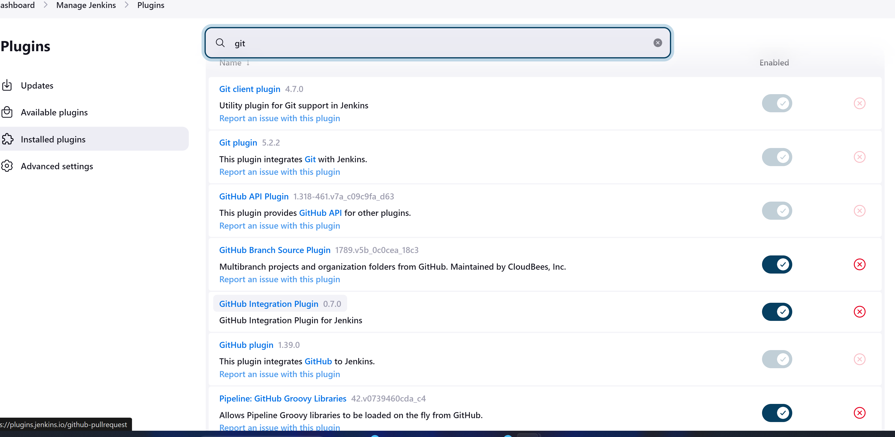


This plugin basically connects Jenkins, with GitHub. It allows Jenkins to automatically perform tasks like building and testing code whenever changes are made in a GitHub repository.
Next is to configure github credentials in Jenkins so that Jenkins can authenticate to the repository.

### Install more plugins
To ensure a seamless and efficient pipeline within Jenkins, It is recommended to install additional essential plugins: the Terraform and the AWS Credentials plugin.

*   Terraform Plugin:

The Terraform plugin for Jenkins enables seamless integration of Terraform into Jenkins pipelines. With this plugin, you can manage the installation of mutliple terraform versions, update terraform modules and do much more as documented in the official site https://plugins.jenkins.io/terraform/

*   AWS Credentials Plugin:

The AWS Credentials plugin is essential for securely managing and utilizing AWS (Amazon Web Services) credentials within Jenkins. This plugin facilitates the secure storage and retrieval of AWS access and secret keys, ensuring that Jenkins jobs and pipelines can securely interact with AWS services during the execution of various tasks and deployments, including terraform runs. You can read more about the plugin here https://plugins.jenkins.io/aws-credentials/


### Configure GitHub Credentials in Jenkins:
Jenkins needs to know how to connect to Github, otherwise in real world cases where repositories are private, it won't know how to access the repository. Hence, the first thing we need to do is to store the github credentials in Jenkins.

```bash
- In Github, navigate to your profile -> Click on "Settings" -> then scroll down to -> "Developer Settings"
```
Generate an access token

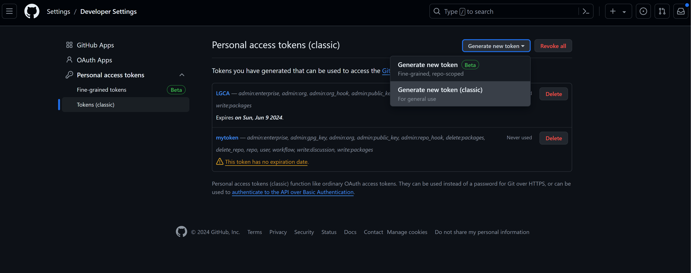

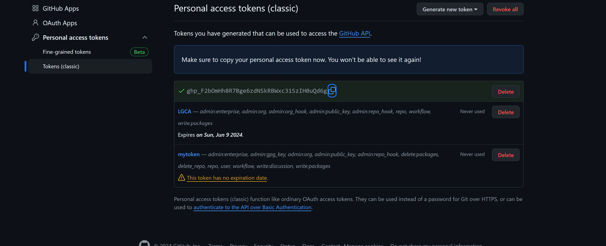

Copy the access token and save in a notepad for use later

In Jenkins, navigate to "Manage Jenkins" -> Click on "Credentials"
Click on the arrow next to "global" and select "Add credentials"

Select username and password. Use the Access token generated earlier as your password, and specify the anything descriptive as your ID

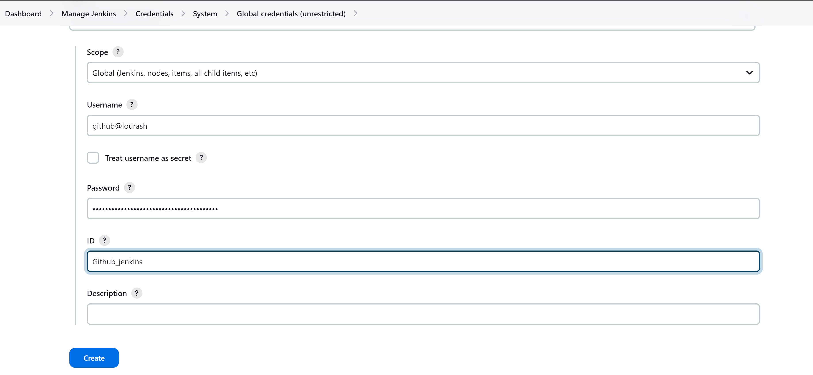

In the credentials section, you will be able to see the created credential


Create a second credential for AWS secret and access key. If you have installed the AWS credentials plugin, you will see the "AWS Credentials" Kind as shown below. Simply add the AWS secret and access key generated from AWS console. 


1.  Set Up a Jenkins Multibranch Pipeline:

From the Jenkins dashboard, click on "New Item"

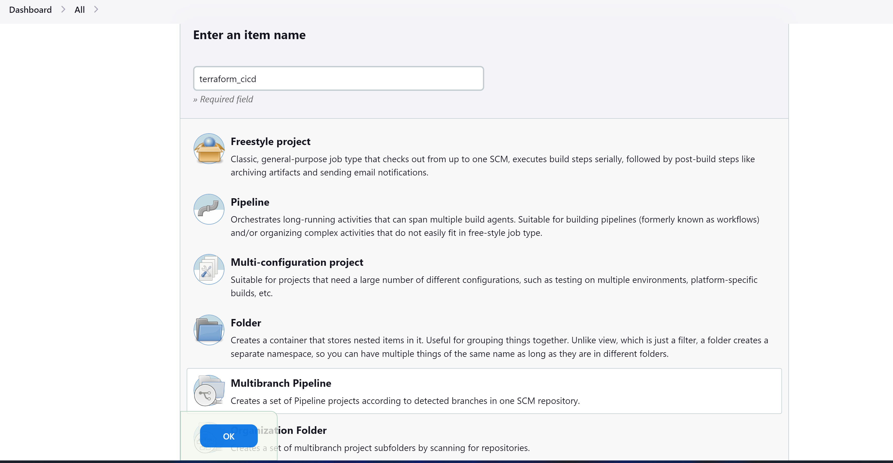

Give it a name and description

Select the type of source of the code and the Jenkinsfile

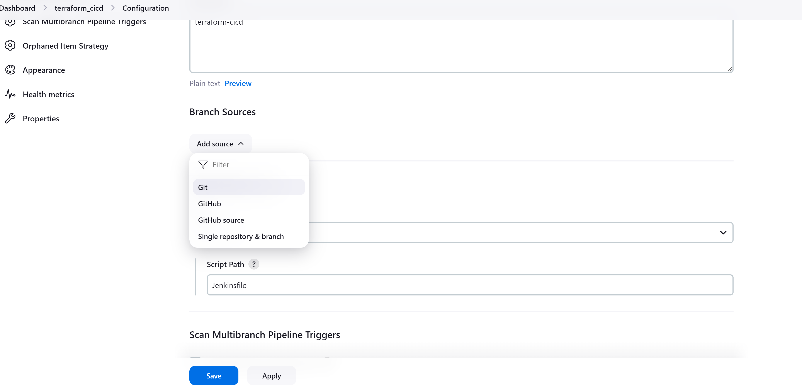

Select the credentials to be used to connect to Github from Jenkins

Add the repository URL. Ensure you have forked it from https://github.com/darey-devops/terraform-aws- pipeline.git/

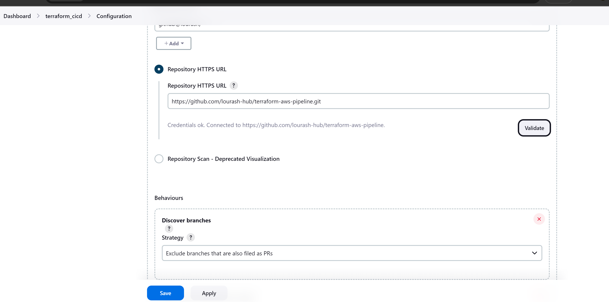

Leave everything at default and hit save

You will immediately see the scanning of the repository for branches, and the Jenkinsfile
The terraform-cicd pipeline and main branch scanned

Click on "Build now" for a second run and check the console output

